# Forge — AI-Native IT 交付与治理基础设施

<div align="center">

**不是 AI 辅助编程工具，而是将 AI 深度嵌入软件交付全生命周期的 AI-Native 基础设施。**

[](LICENSE)
[](https://adoptium.net/)
[](https://kotlinlang.org/)
[](https://nextjs.org/)
[](https://spring.io/projects/spring-boot)

</div>

<div align="center">

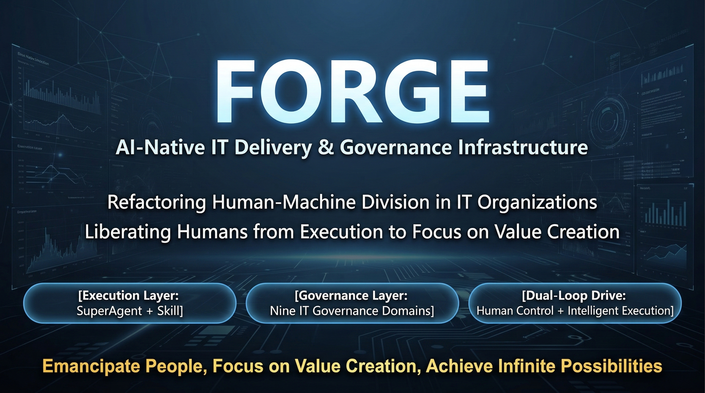

</div>

---

## 项目简介

Forge 是一个 **AI-Native IT 基础设施**，双层协同架构：

- **执行层（Web IDE）**：SuperAgent + 35 个 Skill + 24 个 MCP 工具，三环架构（人类控制环 + 智能执行环 + 进化学习环），将 5-7 人团队的交付能力压缩到 1-2 人 + AI
- **治理层（Enterprise Console）**：Governance AI 覆盖 IT 治理域（组织/成员/Provider 管理），Forge 执行数据驱动治理洞察与决策

<div align="center">

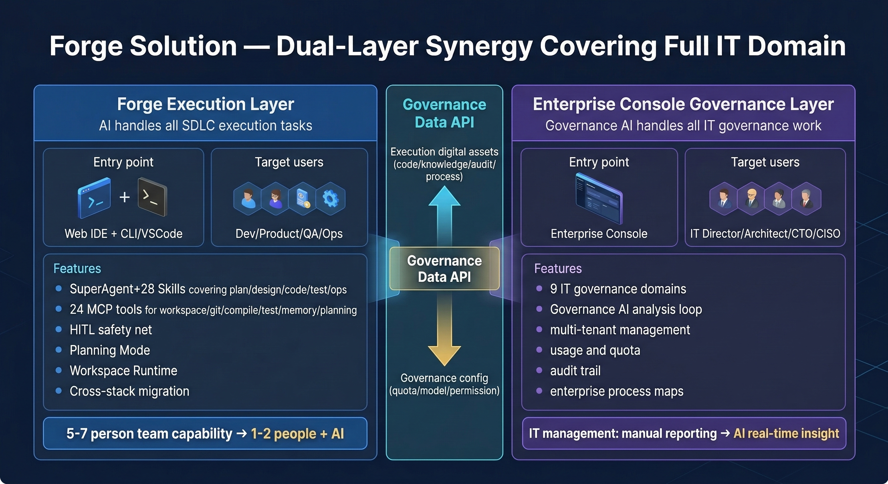

</div>

### 核心理念

| 理念 | 说明 |
|------|------|
| **SuperAgent 优于多 Agent** | 一个智能体通过 Skill 动态切换角色，避免多 Agent 协调复杂度 |
| **Skill 优于 Prompt** | 将专业知识编码为可复用、可组合的 35 个 Skill 资产 |
| **底线保障质量下限** | 无论模型能力如何变化，质量底线脚本必须通过 |
| **双环驱动持续进化** | 交付环解决"做什么"，进化环解决"越做越好" |
| **人机协同（HITL）** | 关键决策点由人类审批，而非全自动黑盒 |

<div align="center">

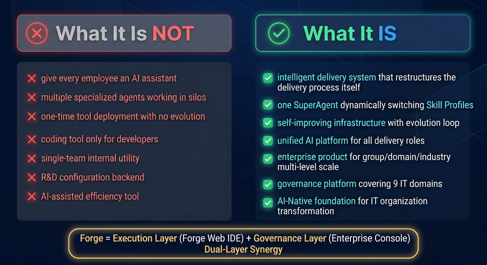

</div>

---

## 核心功能

### SuperAgent 自主执行引擎

用户声明意图，SuperAgent 自主完成规划→编码→验证→交付的完整闭环：

- **50 轮自主执行**：无需逐步指令，Agent 自行决策工具调用、文件读写、代码生成
- **OODA 循环**：Observe → Orient → Decide → Act，每阶段实时可视化
- **24 个 MCP 工具**：文件操作、知识搜索、数据库查询、代码编译、测试运行、服务管理等
- **失败自修复**：底线检查失败后自动分析原因、修改代码、重新验证（最多 2 轮）
- **上下文自管理**：Token 接近上限时自动压缩历史消息，不中断执行

### 6 个 Skill Profile 智能路由

| Profile | 职责 | 典型 Skill |
|---------|------|-----------|
| **planning** | 需求分析、PRD 编写 | requirement-engineering、delivery-methodology |
| **design** | 架构设计、ADR 编写 | architecture-design、api-design、database-patterns |
| **development** | 编码实现、代码生成 | code-generation、kotlin-conventions、spring-boot-patterns |
| **testing** | 测试策略、用例编写 | test-case-writing、testing-standards |
| **ops** | 部署运维、问题排查 | deployment-ops、logging-observability |
| **evaluation** | 进度评估、知识萃取、文档生成 | progress-evaluation、knowledge-distillation |

路由支持 4 级优先级：显式标签（`@开发`）→ 关键词检测 → 分支名模式 → 默认回退。

### 35 个 Skill 资产库

| 插件包 | Skills | 说明 |
|--------|--------|------|
| **forge-superagent** | 14 个 | architecture-design, bug-fix-workflow, code-generation, delivery-methodology, deployment-ops, detailed-design, document-generation, git-workflow, knowledge-distillation, knowledge-generator, planning-mode, progress-evaluation, requirement-engineering, test-case-writing |
| **forge-foundation** | 16 个 | api-design, business-rule-extraction, codebase-profiler, convention-miner, database-patterns, deployment-readiness-check, design-baseline-guardian, environment-parity, error-handling, gradle-build, java-conventions, kotlin-conventions, logging-observability, security-practices, spring-boot-patterns, testing-standards |
| **forge-knowledge** | 3 个 | domain-model-knowledge, internal-api-knowledge, runbook-knowledge |
| **forge-deployment** | 2 个 | ci-cd-patterns, kubernetes-patterns |

### 三层跨 Session 记忆系统

解决 AI Agent "每次重新开始"的核心痛点：

| 层级 | 名称 | 范围 | 容量 |
|------|------|------|------|
| Layer 1 | **Workspace Memory** | 工作区级 | 4,000 字符 |
| Layer 2 | **Stage Memory** | Profile × Workspace | 8,000 字符 |
| Layer 3 | **Session Summary** | 单次会话 | 2,000 字符/条 |

效果：新 Session 启动即拥有项目上下文，节省 30-40% Token 消耗。

### 质量保障体系

- **底线自动检查**：代码生成后自动运行 code-style / security / api-contract / architecture 底线
- **HITL 审批检查点**：关键交付节点暂停等待人工审批，支持 Approve / Reject / Modify
- **四维评估学习闭环**：意图理解 + 完成度 + 质量 + 体验，自动生成改进建议
- **Prompt Caching**：System Prompt 缓存 5 分钟，缓存命中节省 90% 成本

### Web IDE

```
┌─────────────────────────────────────────────────────────────────┐
│ Header — 角色切换 + 模型选择 + 用户菜单                          │
├──────────┬──────────────────────────────┬───────────────────────┤
│ File     │ Monaco Editor                │ AI Chat Sidebar       │
│ Explorer │   - 25+ 语言语法高亮          │  4-Tab:               │
│          │   - 多 Tab 文件编辑           │  [对话|质量|Skills|记忆]│
│  CRUD:   │   - AI Explain 按钮          │   - 流式响应展示       │
│  新建    │   - 5 秒自动保存             │   - Tool Call 展开    │
│  重命名  ├──────────────────────────────┤   - OODA 指示器       │
│  删除    │ Terminal Panel（可折叠）       │   - Profile Badge     │
└──────────┴──────────────────────────────┴───────────────────────┘
```

前端页面路由：`workspaces`（列表）、`workspace/[id]`（IDE 主界面）、`knowledge`（知识库）、`skills`（Skill 管理）、`workflows`（工作流）、`evaluations`（评估报告）、`login`

### Enterprise Console（治理控制台）

独立部署的企业治理界面，覆盖：
- **组织管理**（`/orgs`）：多组织 CRUD、成员管理
- **邀请管理**（`/invite`）：邀请链接创建与接受
- **Provider 管理**：AI 模型 Provider 配置与健康检查

### 多模型支持

| Provider | 支持模型 | Context Window |
|----------|---------|----------------|
| **Anthropic Claude** | Opus 4.6 / Sonnet 4.5 / Haiku 4.5 | 200K |
| **Google Gemini** | Gemini Pro | 30K |
| **Alibaba Qwen** | Qwen2.5-7B / 72B | 32K |
| **AWS Bedrock** | Claude via AWS | Provider-specific |
| **MiniMax** | M2.5 / M2.5-lightning / M2.5-highspeed | 1M |
| **OpenAI-compatible** | 任意兼容 OpenAI API 的服务 | Provider-specific |

---

## 技术架构

<div align="center">

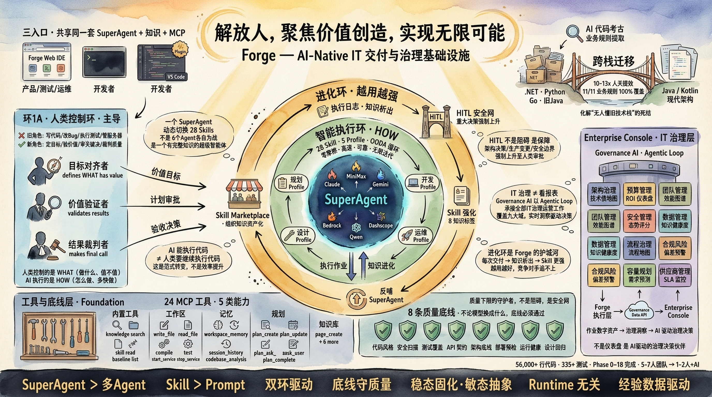

</div>

### 系统架构图

```
┌─ 用户交互层 ─────────────────────────────────────────────────────┐
│  Web IDE (Next.js 15)  │  Enterprise Console (Next.js 15)        │
│  CLI (Kotlin + GraalVM Native)                                   │
└──────────────────────────────────────────────────────────────────┘
                          │
┌─ 应用层 ─────────────────────────────────────────────────────────┐
│  Spring Boot 3 Backend                                            │
│  ├─ AgenticLoopOrchestrator (50 轮自主执行管线)                   │
│  ├─ ProfileRouter (6 Profile 智能路由)                            │
│  ├─ SkillLoader (35 Skill 动态加载)                               │
│  ├─ SystemPromptAssembler (动态 Prompt 组装)                      │
│  ├─ McpProxyService (24 工具调用代理)                             │
│  ├─ MemoryContextLoader (三层记忆注入)                            │
│  ├─ HitlCheckpointManager (HITL 审批管理)                        │
│  └─ LearningLoopPipelineService (学习闭环)                       │
└──────────────────────────────────────────────────────────────────┘
                          │
┌─ MCP 工具层 ─────────────────────────────────────────────────────┐
│  forge-knowledge-mcp:8081  │  forge-database-mcp:8082            │
│  forge-service-graph-mcp   │  forge-artifact-mcp                 │
│  forge-observability-mcp   │  (内置 workspace/baseline 工具)     │
└──────────────────────────────────────────────────────────────────┘
                          │
┌─ 模型适配层 ─────────────────────────────────────────────────────┐
│  ClaudeAdapter  │  GeminiAdapter  │  QwenAdapter                 │
│  BedrockAdapter │  OpenAIAdapter  │  (统一 ModelAdapter 接口)     │
└──────────────────────────────────────────────────────────────────┘
```

<div align="center">

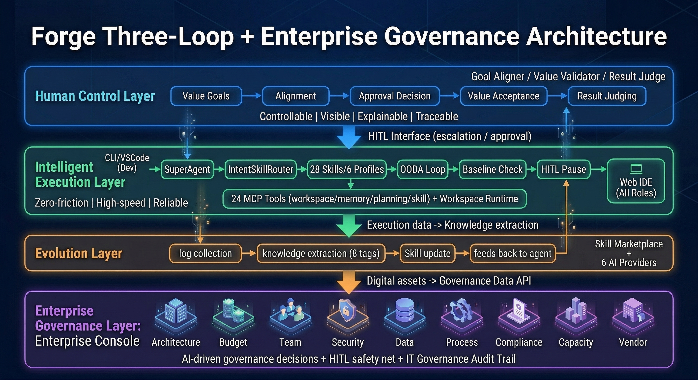

</div>

### 技术栈

| 层 | 技术 | 版本 |
|---|------|------|
| 后端语言 | Kotlin | 1.9+ |
| 后端框架 | Spring Boot | 3.3+ |
| 运行时 | JDK | 21 |
| 前端框架 | Next.js + React | 15 + 19 |
| 前端语言 | TypeScript | 5.x |
| 数据库（开发） | H2 文件持久化 | — |
| 数据库（生产） | PostgreSQL | 16 |
| 数据库迁移 | Flyway | 8 个版本（V1-V8） |
| 代码编辑器 | Monaco Editor | 4.6+ |
| 工作流画布 | ReactFlow | 12.3+ |
| 架构图渲染 | Mermaid | 11.4+ |
| 认证 | Keycloak | 24.0 |
| 监控 | Prometheus + Micrometer | — |
| 容器化 | Docker Compose | 7 容器 |

### Gradle 模块结构

```
forge-platform/
├── web-ide/
│   ├── backend/          # Spring Boot 3 后端（Kotlin，22 个 Controller）
│   └── frontend/         # Next.js 15 前端（TypeScript，8 个页面路由）
├── enterprise-console/   # 企业治理控制台（Next.js 15，独立部署）
├── mcp-servers/
│   ├── forge-mcp-common/        # MCP 协议公共库
│   ├── forge-knowledge-mcp/     # 知识库 MCP 服务器
│   ├── forge-database-mcp/      # 数据库 MCP 服务器
│   ├── forge-service-graph-mcp/ # 服务拓扑 MCP 服务器
│   ├── forge-artifact-mcp/      # 构建产物 MCP 服务器
│   └── forge-observability-mcp/ # 可观测性 MCP 服务器
├── adapters/
│   ├── model-adapter/    # 模型适配器（Claude/Gemini/Qwen/Bedrock）
│   └── runtime-adapter/  # Runtime 适配器
├── plugins/
│   ├── forge-foundation/  # 基础 Skill（16 个：Kotlin/Java/Spring/API 规范等）
│   ├── forge-superagent/  # SuperAgent Skill（14 个）+ 6 个 Profile
│   ├── forge-knowledge/   # 知识类 Skill（3 个）
│   ├── forge-deployment/  # 部署类 Skill（2 个：K8s/CI-CD）
│   └── forge-team-templates/ # 团队模板（backend/data/mobile）
├── cli/                   # Forge CLI（Kotlin + GraalVM Native）
├── agent-eval/            # SuperAgent 评估框架
├── skill-tests/           # Skill 验证框架
├── knowledge-base/        # 知识库文档（13+ 篇）
└── infrastructure/
    └── docker/            # Docker Compose 部署配置（4 套环境）
```

---

## 快速启动

### 前置条件

| 项目 | 要求 | 验证命令 |
|------|------|---------|
| JDK | **21**（必须！JDK 8/17 会编译失败） | `java -version` |
| Docker Engine | 24+ | `docker --version` |
| Docker Compose | v2+ | `docker compose version` |
| Node.js | 20+ | `node --version` |
| 可用内存 | ≥ 8 GB（分配给 Docker） | Docker Desktop → Resources |
| API Key | 至少 1 个 Provider | 见下方配置说明 |

### Step 1: 克隆仓库

```bash
git clone git@github.com:pan94u/forge.git
cd forge
```

### Step 2: 配置环境变量

```bash
cp .env.example infrastructure/docker/.env
```

编辑 `infrastructure/docker/.env`，至少填入一个 Provider 的 API Key：

```bash
# Anthropic Claude（推荐）
ANTHROPIC_API_KEY=sk-ant-api03-你的密钥

# 或 Google Gemini
# GEMINI_API_KEY=AIza...

# 或阿里云 DashScope（通义千问）
# DASHSCOPE_API_KEY=sk-...

# 或 MiniMax
# MINIMAX_API_KEY=...

# 或 OpenAI 兼容接口（Ollama/vLLM/LocalAI 等）
# LOCAL_MODEL_URL=http://localhost:11434
# LOCAL_MODEL_NAME=llama3.1:8b
```

### Step 3: 本地构建

```bash
# 确保 JDK 21（macOS 示例）
export JAVA_HOME=/opt/homebrew/opt/openjdk@21

# 构建后端 JAR（跳过测试加速）
./gradlew :web-ide:backend:bootJar -x test --no-daemon

# 构建前端
cd web-ide/frontend && npm install && npm run build && cd ../..

# 构建 Enterprise Console（可选）
cd enterprise-console && npm install && npm run build && cd ..
```

### Step 4: Docker 启动

```bash
cd infrastructure/docker
docker compose -f docker-compose.trial.yml --env-file .env up --build -d
```

### Step 5: 验证启动

```bash
# 检查 7 个容器状态（均应为 healthy 或 running）
docker compose -f docker-compose.trial.yml ps

# 测试 API
curl -s http://localhost:19000/api/models | python3 -m json.tool
```

### Step 6: 访问平台

| 服务 | 地址 | 说明 |
|------|------|------|
| **Web IDE** | http://localhost:19000 | 主 IDE 界面 |
| **Enterprise Console** | http://localhost:19001 | 企业治理控制台 |
| **Knowledge MCP** | http://localhost:19081 | 知识库 MCP 服务 |
| **Database MCP** | http://localhost:19082 | 数据库 MCP 服务 |

---

## 技术规格

| 维度 | 数值 |
|------|------|
| REST API Controller | 22 个 |
| REST API 端点 | 70+ 个 |
| SSE 事件类型 | 14 种 |
| MCP 工具 | 24 个（5 类：builtin/knowledge/workspace/memory/planning） |
| JPA Entity | 12 个 |
| Flyway 迁移 | 8 个版本（V1-V8） |
| Skill 总数 | 35 个（4 个插件包，6 个 Profile） |
| 单元测试 | 156 个（全部通过） |
| Docker 容器 | 7 个（postgres + knowledge-mcp + database-mcp + backend + frontend + enterprise-console + nginx） |
| 知识库文档 | 13+ 篇 |
| 代码规模 | ~50K+ 行（Kotlin + TypeScript） |
| 前端页面路由 | 8 个（Web IDE）+ 2 个（Enterprise Console） |
| 支持模型 | 6 个 Provider（13+ 模型） |
| Context Window | 最大 200K tokens（Claude Opus） |
| 自主执行轮次 | 最多 50 轮 |

<div align="center">

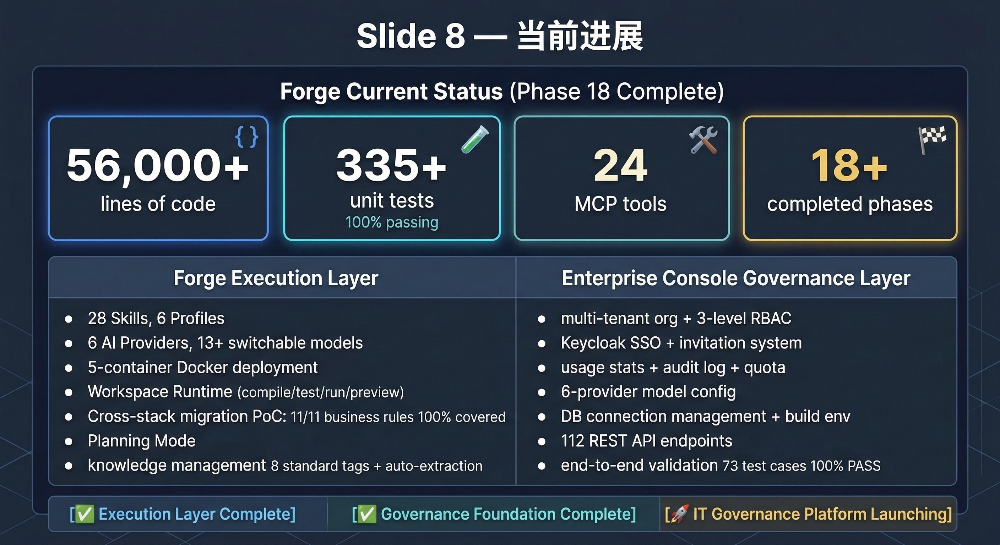

</div>

---

## 演进路线

<div align="center">

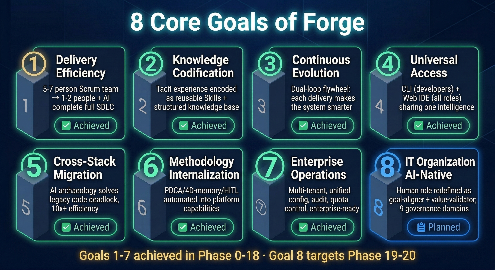

</div>

| 阶段 | 关键词 | 状态 | 核心能力 |
|------|--------|------|---------|
| Phase 0 | 基础骨架 | ✅ | Foundation Skills + MCP Server + CLI + 插件体系 |
| Phase 1 | Web IDE 实连 | ✅ | 真流式 + Agentic Loop + 跨栈画像 |
| Phase 1.5 | 设计守护 + Docker | ✅ | Docker 部署 + E2E 验证 + 设计基线冻结 |
| Phase 1.6 | AI 交付闭环 + SSO | ✅ | AI→Workspace 写文件 + Keycloak SSO + Context Picker |
| Phase 2 | 质量基础设施 | ✅ | CI/CD + SkillLoader + MCP 真实服务 + 多模型适配 |
| Phase 3 | HITL + 记忆 | ✅ | 三层记忆 + HITL 审批 + 学习闭环 + 质量面板 |
| Phase 4 | Skill 架构改造 | ✅ | 渐进式加载 + Skill 管理 + 使用追踪 |
| Phase 5 | 产品可用性 | ✅ | Workspace 持久化 + Git Clone + 用户 API Key |
| Phase 6 | 知识写入 + 多模型 | ✅ | MiniMax + 知识库本地写入 + Agentic Loop 50 轮 |
| Phase 7 | 异步化 + 知识 Scope | ✅ | Git Clone 异步 + 知识库三层 Scope + CRUD |
| Phase 8 | Enterprise Console | ✅ | 治理控制台 + 组织管理 + Provider 管理 |
| Phase 9+ | 进化环闭合 | 🔄 | ForgeNativeRuntime + 方法论平台化 |

<div align="center">

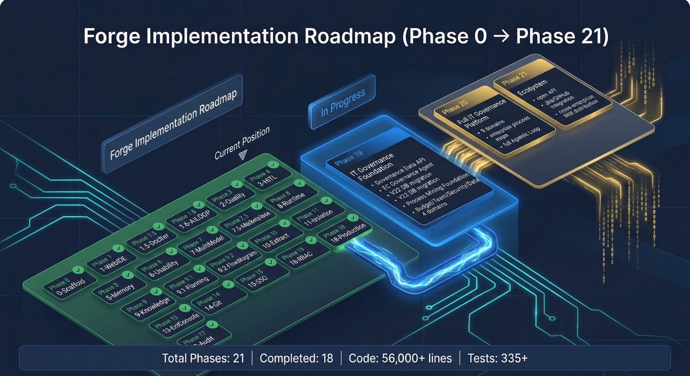

</div>

<div align="center">

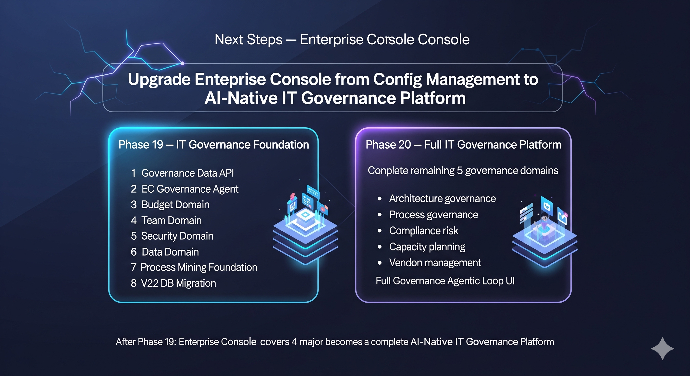

</div>

---

## 竞争优势

<div align="center">

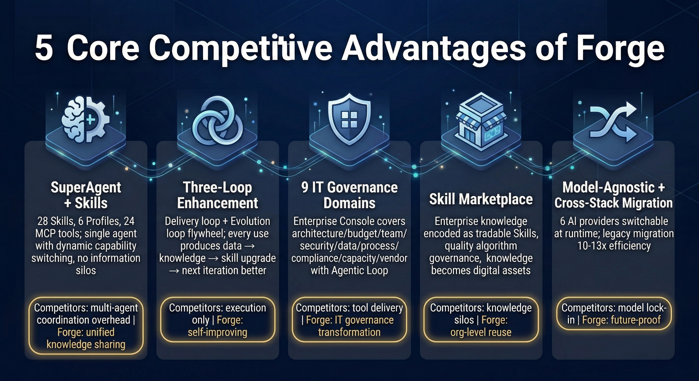

</div>

---

## 生态愿景：Forge × Synapse AI

<div align="center">

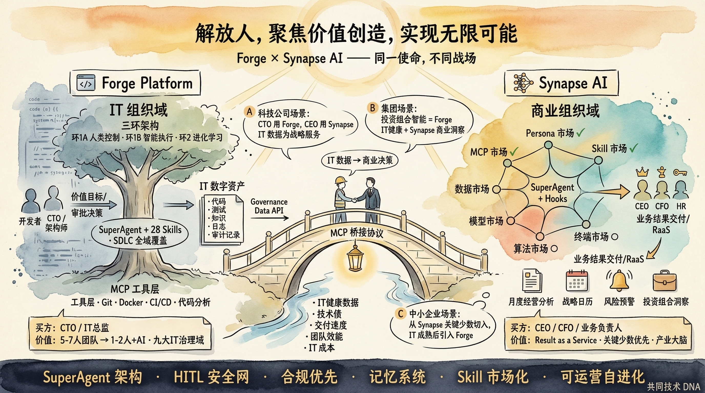

</div>

同一使命，不同战场：Forge 深耕 IT 组织域（执行+治理），[Synapse AI](https://github.com/pan94u/Synapse-AI) 覆盖商业组织域（RaaS·关键少数·产业大脑），通过 MCP 桥接协议实现 IT 数据 → 商业决策的闭环。

---

## 开发指南

### 运行单元测试

```bash
# 后端测试
./gradlew :web-ide:backend:test :adapters:model-adapter:test

# 评估框架测试
./gradlew :agent-eval:test
```

### 本地开发模式（不使用 Docker）

```bash
# 启动后端
cd web-ide/backend
./gradlew bootRun

# 启动前端（新终端）
cd web-ide/frontend
npm run dev
# 访问 http://localhost:3000

# 启动 Enterprise Console（新终端）
cd enterprise-console
npm run dev
# 访问 http://localhost:19001
```

### 常见问题

| 问题 | 解决方案 |
|------|---------|
| JDK 版本错误 | 必须使用 JDK 21，`export JAVA_HOME=/opt/homebrew/opt/openjdk@21` |
| 前端类型错误 | 使用 `npm run build` 而非 `npm run dev`（dev 不检查类型） |
| WebSocket CORS | `forge.websocket.allowed-origins` 必须为逗号分隔字符串 |
| 枚举序列化 | 所有枚举必须加 `@JsonValue` 返回小写 |
| 空字符串 vs null | 使用 `isNullOrBlank()` 而非 `?: default` |
| workspaceId 传递 | REST API 和 WebSocket 是两条独立路径，都需要传 workspaceId |

---

## 文档索引

| 文档 | 路径 | 说明 |
|------|------|------|
| 产品功能清单 | `docs/product/feature-list.md` | 完整功能描述（面向用户） |
| 设计基线 | `docs/baselines/design-baseline-v1.md` | 已验证的 UI/API/数据模型基线 |
| 规划基线 | `docs/baselines/planning-baseline-v1.5.md` | 设计驱动的规划文档 |
| 开发日志 | `docs/planning/dev-logbook.md` | 完整的 Session 开发记录 |
| 架构概览 | `docs/architecture/overview.md` | 系统架构文档 |
| 试用指南 | `docs/product/TRIAL-GUIDE.md` | 内部试用操作手册 |
| 验收测试 | `docs/acceptance-tests/` | 各阶段验收测试报告 |
| Bug 列表 | `docs/analysis/buglist.md` | 已知问题追踪 |

---

## 贡献

欢迎参与贡献！你可以通过以下方式参与：

- **提交 Issue**：报告 Bug、提出功能建议或改进想法
- **提交 Pull Request**：修复 Bug、完善文档、新增 Skill
- **扩展 Skill**：在 `plugins/` 目录下添加新的 Skill 或 Profile
- **完善知识库**：在 `knowledge-base/` 目录下补充文档

提交 PR 前请确保：
1. 单元测试全部通过：`./gradlew :web-ide:backend:test`
2. 前端构建无错误：`cd web-ide/frontend && npm run build`
3. 遵循现有代码风格（Kotlin 编码规范见 `plugins/forge-foundation/skills/kotlin-conventions/`）

> **注意**：提交贡献即表示你同意将贡献内容授权给 The Forge Contributors，详见 [LICENSE](LICENSE)。

---

## 许可证

本项目采用 [Forge Source Available License v1.0](LICENSE)。

- ✅ 允许：查看源码、个人学习、非商业用途使用与修改、提交贡献
- ❌ 禁止：商业用途（含 SaaS、内部商业工具、咨询服务）需获得书面授权

商业授权咨询：https://github.com/pan94u/forge/issues

---

<div align="center">

**Forge — 让 AI 真正参与软件交付，而不只是辅助编程**

</div>
