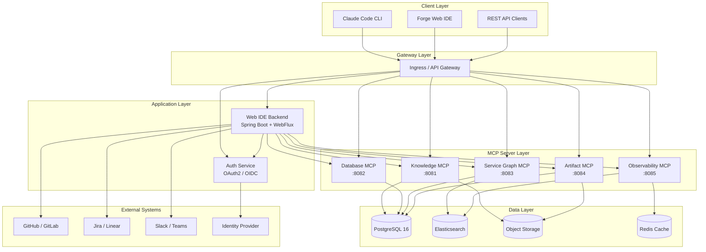

# Forge Platform — Architecture Overview

## 1. Introduction

Forge is an enterprise-grade AI-assisted software delivery platform built around
Claude Code and the Model Context Protocol (MCP). It provides a structured
environment where AI agents operate within well-defined guardrails, leveraging
organizational knowledge to produce consistent, high-quality software artifacts.

This document describes the core architectural principles, component model, and
system topology that underpin the Forge platform.

---

## 2. Design Principles

| Principle | Description |
|---|---|
| **Guardrails over gatekeeping** | Guide the AI with context rather than blocking it with rules. |
| **Context is king** | The quality of AI output is directly proportional to the quality of context provided. |
| **Layered autonomy** | Org → Team → Project context layers, each adding specificity. |
| **Observable by default** | Every AI action, decision, and artifact is logged and traceable. |
| **Human-in-the-loop** | Critical decisions require explicit human approval. |
| **Composable skills** | Knowledge is modular, versioned, and reusable across teams. |

---

## 3. Dual-Loop Architecture

Forge operates on two complementary feedback loops that drive continuous
improvement across the entire software delivery lifecycle.

### 3.1 Delivery Loop (Inner)

The Delivery Loop is the real-time execution path where work gets done. It
follows a tight cycle:

1. **Task Intake** — A developer or system provides a task (Jira ticket, CLI
   command, Web IDE prompt).
2. **Context Assembly** — The SuperAgent gathers relevant context: CLAUDE.md
   files (org/team/project), skill profiles, service graph data, and codebase
   knowledge.
3. **OODA Execution** — Claude Code executes the task using the Observe-Orient-
   Decide-Act inner loop (see Section 5).
4. **Artifact Production** — Code, tests, documentation, or configuration files
   are produced.
5. **Review & Merge** — Human review gates ensure quality before merging.

### 3.2 Learning Loop (Outer)

The Learning Loop captures insights from the Delivery Loop and feeds them back
into the platform's knowledge base:

1. **Telemetry Collection** — Every AI session emits structured telemetry:
   tokens used, files touched, commands run, errors encountered.
2. **Pattern Extraction** — Recurring patterns (successful approaches, common
   failures) are identified through analysis.
3. **Knowledge Refinement** — Skill Profiles and CLAUDE.md templates are updated
   based on what works.
4. **Guardrail Tuning** — Security rules, review policies, and automation
   thresholds are adjusted.
5. **Metric Dashboarding** — KPIs (cycle time, first-pass review rate, defect
   density) are tracked over time.

```
┌─────────────────────────────────────────────────────────┐
│                    LEARNING LOOP                        │
│  Telemetry → Pattern Extraction → Knowledge Refinement  │
│       ↑                                      ↓          │
│  ┌─────────────────────────────────────────────────┐    │
│  │              DELIVERY LOOP                      │    │
│  │  Task → Context → OODA → Artifact → Review     │    │
│  └─────────────────────────────────────────────────┘    │
└─────────────────────────────────────────────────────────┘
```

---

## 4. SuperAgent and Skill Profile Model

### 4.1 SuperAgent

The SuperAgent is the conceptual wrapper around a Claude Code session that has
been enriched with full Forge context. It is not a separate service but rather
the combination of:

- **Claude Code** as the execution engine.
- **CLAUDE.md hierarchy** (org → team → project) providing layered instructions.
- **Skill Profiles** supplying domain-specific knowledge and patterns.
- **MCP Servers** giving access to live infrastructure data.

The SuperAgent pattern ensures that every AI session starts with the right
context, follows organizational standards, and has access to the tools it needs.

### 4.2 Skill Profiles

A Skill Profile is a versioned, structured knowledge package that teaches the AI
how to perform a specific class of tasks. Each profile contains:

| Component | Purpose |
|---|---|
| `skill.yaml` | Metadata: name, version, domain, dependencies. |
| `context/` | Background knowledge the AI needs (architecture docs, API specs). |
| `patterns/` | Reusable code patterns and templates with explanations. |
| `guardrails/` | Rules and constraints specific to this skill domain. |
| `examples/` | Worked examples showing input → output transformations. |
| `tests/` | Validation tests that verify skill correctness. |

Skill Profiles are stored in a central registry and composed at runtime based on
the task at hand. A single session may activate multiple skills (e.g.,
`kotlin-service` + `postgresql-repository` + `openapi-spec`).

### 4.3 Skill Composition

Skills are composed using a dependency graph. When a task requires the
`rest-api-kotlin` skill, Forge automatically resolves and loads its dependencies:

```
rest-api-kotlin
  ├── kotlin-service (foundation)
  ├── spring-boot-web (foundation)
  ├── openapi-spec (domain)
  └── error-handling (foundation)
```

---

## 5. OODA Inner Loop

Each task execution follows the OODA (Observe-Orient-Decide-Act) loop, which
structures how Claude Code approaches problems:

### 5.1 Observe

- Read the task description and acceptance criteria.
- Query MCP servers for relevant context (service graph, existing code, DB
  schemas).
- Load applicable Skill Profiles.
- Scan CLAUDE.md files for relevant rules and conventions.

### 5.2 Orient

- Analyze the gathered context against the task requirements.
- Identify which files need to be created or modified.
- Determine which patterns from Skill Profiles apply.
- Assess risk factors (security implications, breaking changes, data migrations).

### 5.3 Decide

- Formulate an execution plan with discrete steps.
- Select the appropriate tools and MCP queries for each step.
- Identify decision points that require human approval.
- Estimate scope and flag if the task seems larger than expected.

### 5.4 Act

- Execute the plan step by step.
- Write code following the patterns and guardrails.
- Run tests to validate correctness.
- Produce a summary of changes for human review.

---

## 6. MCP Server Ecosystem

Forge provides a suite of MCP (Model Context Protocol) servers that give Claude
Code structured access to enterprise systems. Each server exposes a focused set
of tools and resources.

| MCP Server | Port | Purpose |
|---|---|---|
| `forge-knowledge-mcp` | 8081 | Skill Profile registry, CLAUDE.md management, pattern search. |
| `forge-database-mcp` | 8082 | Schema introspection, query generation, migration scaffolding. |
| `forge-service-graph-mcp` | 8083 | Service topology, API contracts, dependency mapping. |
| `forge-artifact-mcp` | 8084 | Build artifact metadata, deployment history, version tracking. |
| `forge-observability-mcp` | 8085 | Logs, metrics, traces, error aggregation, SLO status. |

### 6.1 MCP Communication Model

All MCP servers follow a standard communication model:

- **Transport**: JSON-RPC over HTTP (SSE for streaming).
- **Authentication**: mTLS between services; OAuth2 bearer tokens from external
  callers.
- **Schema**: Each server publishes a tool manifest describing available
  operations, parameters, and return types.
- **Health**: Standard health endpoints (`/health/live`, `/health/ready`) for
  orchestration.

### 6.2 MCP Server Internal Architecture

Each MCP server follows a layered Kotlin/Spring Boot architecture:

```
┌──────────────────────────┐
│    MCP Transport Layer   │  ← JSON-RPC / SSE handling
├──────────────────────────┤
│    Tool Handler Layer    │  ← Business logic per tool
├──────────────────────────┤
│    Domain Service Layer  │  ← Core domain operations
├──────────────────────────┤
│    Adapter Layer         │  ← External system integration
└──────────────────────────┘
```

---

## 7. Web IDE Architecture

The Forge Web IDE provides a browser-based interface for interacting with the
SuperAgent, managing Skill Profiles, and monitoring AI sessions.

### 7.1 Frontend

- **Framework**: React 18+ with TypeScript.
- **State management**: Zustand for global state.
- **Terminal emulation**: xterm.js for Claude Code output streaming.
- **Editor**: Monaco Editor for code viewing and editing.
- **Communication**: WebSocket for real-time session streaming; REST for CRUD
  operations.

### 7.2 Backend

- **Framework**: Spring Boot 3 (Kotlin) with WebFlux for reactive endpoints.
- **WebSocket**: STOMP over WebSocket for session multiplexing.
- **Session management**: Each user session maps to a Claude Code process.
- **Authentication**: OAuth2 / OIDC with configurable identity providers.
- **Authorization**: Role-based access control (Admin, Lead, Developer, Viewer).

### 7.3 Frontend-Backend Communication

```
┌──────────┐  WebSocket (STOMP)  ┌──────────┐  stdio  ┌─────────────┐
│ Browser  │ ←──────────────────→│ Backend  │←───────→│ Claude Code │
│ (React)  │  REST (HTTP)        │ (Spring) │         │  Process    │
└──────────┘                     └──────────┘         └─────────────┘
                                      ↕ HTTP
                                ┌─────────────┐
                                │ MCP Servers  │
                                └─────────────┘
```

---

## 8. Adapter Layer Design

The Adapter Layer provides a clean abstraction between Forge's core domain logic
and external systems. This ensures that external dependencies can be swapped
without modifying core business logic.

### 8.1 Adapter Categories

| Category | Examples |
|---|---|
| **SCM Adapters** | GitHub, GitLab, Bitbucket — repository operations, PR management. |
| **CI/CD Adapters** | GitHub Actions, Jenkins, GitLab CI — pipeline triggers, status. |
| **Issue Tracker Adapters** | Jira, Linear, GitHub Issues — ticket management. |
| **Identity Adapters** | Okta, Azure AD, Keycloak — authentication and authorization. |
| **Notification Adapters** | Slack, Teams, Email — alerts and notifications. |

### 8.2 Adapter Interface Contract

Every adapter implements a standard interface:

```kotlin
interface ForgeAdapter<TConfig : AdapterConfig> {
    val type: AdapterType
    val version: String

    fun initialize(config: TConfig)
    fun healthCheck(): HealthStatus
    fun shutdown()
}

interface ScmAdapter : ForgeAdapter<ScmConfig> {
    suspend fun listRepositories(org: String): List<Repository>
    suspend fun getFileContent(repo: String, path: String, ref: String): FileContent
    suspend fun createPullRequest(repo: String, pr: PullRequestCreate): PullRequest
    suspend fun getPullRequestStatus(repo: String, prId: Long): PullRequestStatus
}
```

### 8.3 Adapter Registration

Adapters are registered via Spring's dependency injection and selected at runtime
based on tenant configuration. This allows multi-tenant deployments where
different teams use different SCM or CI/CD providers.

---

## 9. System Architecture Diagram



---

## 10. Data Flow: End-to-End Task Execution

The following sequence describes how a task flows through the Forge platform from
initiation to completion:

1. **Developer** opens the Web IDE and types: "Implement the user registration
   endpoint per JIRA-1234."
2. **Web IDE Backend** authenticates the request, creates a session, and spawns a
   Claude Code process.
3. **Claude Code** receives the prompt along with the assembled CLAUDE.md context
   (org + team + project).
4. **OODA — Observe**: Claude Code calls `forge-service-graph-mcp` to understand
   the service topology and calls `forge-knowledge-mcp` to load the
   `rest-api-kotlin` and `spring-security` Skill Profiles.
5. **OODA — Orient**: Claude Code analyzes the existing codebase structure, reads
   the Jira ticket details, and identifies affected modules.
6. **OODA — Decide**: Claude Code formulates a plan: create controller, service,
   repository, DTO, migration, and tests.
7. **OODA — Act**: Claude Code writes the code, runs `./gradlew test`, and
   produces a change summary.
8. **Web IDE** streams the output in real time via WebSocket.
9. **Developer** reviews the changes, requests minor adjustments, and approves.
10. **Claude Code** creates a branch, commits the changes, and opens a pull
    request via the SCM adapter.
11. **Learning Loop** captures session telemetry for future pattern extraction.

---

## 11. Security Architecture

### 11.1 Authentication

- All external access goes through the API Gateway with OAuth2/OIDC
  authentication.
- Service-to-service communication uses mTLS with certificates managed by the
  platform.
- MCP servers validate bearer tokens on every request.

### 11.2 Authorization

- RBAC with four roles: Admin, Lead, Developer, Viewer.
- Skill Profile modifications require role-appropriate approval (see Governance).
- Claude Code sessions inherit the invoking user's permissions.

### 11.3 Secret Management

- No secrets in code — enforced by pre-commit hooks and CI scanning.
- Runtime secrets injected via Kubernetes Secrets or Vault.
- MCP servers access credentials through environment variables only.

### 11.4 Audit Trail

- Every Claude Code action is logged with: user, timestamp, action, files
  affected, tokens consumed.
- Audit logs are immutable and stored in a dedicated logging pipeline.
- Compliance reports can be generated per team, project, or time range.

---

## 12. Scalability Considerations

| Component | Scaling Strategy |
|---|---|
| MCP Servers | Horizontal pod autoscaling based on request rate. |
| Web IDE Backend | Session-affinity routing with horizontal scaling. |
| PostgreSQL | Primary-replica with connection pooling (PgBouncer). |
| Elasticsearch | Multi-node cluster with index lifecycle management. |
| Claude Code processes | Bounded by concurrent session limits per node. |

---

## 13. Technology Stack Summary

| Layer | Technology |
|---|---|
| Language | Kotlin 1.9+ on JDK 21 |
| Framework | Spring Boot 3.x, Spring WebFlux |
| Build | Gradle 8.x with Kotlin DSL |
| Frontend | React 18, TypeScript, Vite |
| Database | PostgreSQL 16 |
| Search | Elasticsearch 8.x |
| Cache | Redis 7.x |
| Container | Docker, Kubernetes |
| MCP Transport | JSON-RPC over HTTP, SSE |
| Auth | OAuth2 / OIDC |
| Observability | OpenTelemetry, Prometheus, Grafana |
