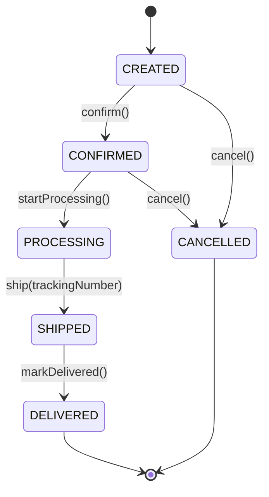

# Order Domain

## Domain Model

## Business Rules
1. **Order minimum**: Orders must have at least 1 item and total ≥ $1.00
2. **Cancellation window**: Orders can only be cancelled in CREATED or CONFIRMED state
3. **Stock reservation**: Stock is reserved on CONFIRMED, released on CANCELLED
4. **Idempotency**: Create order uses idempotency key from checkout session

## Code Entry Points
- `OrderController` — `/api/v1/orders`
- `OrderService` — Order lifecycle management
- `OrderRepository` — JPA persistence
- `OrderEventPublisher` — Publishes OrderCreated, OrderConfirmed, etc.
