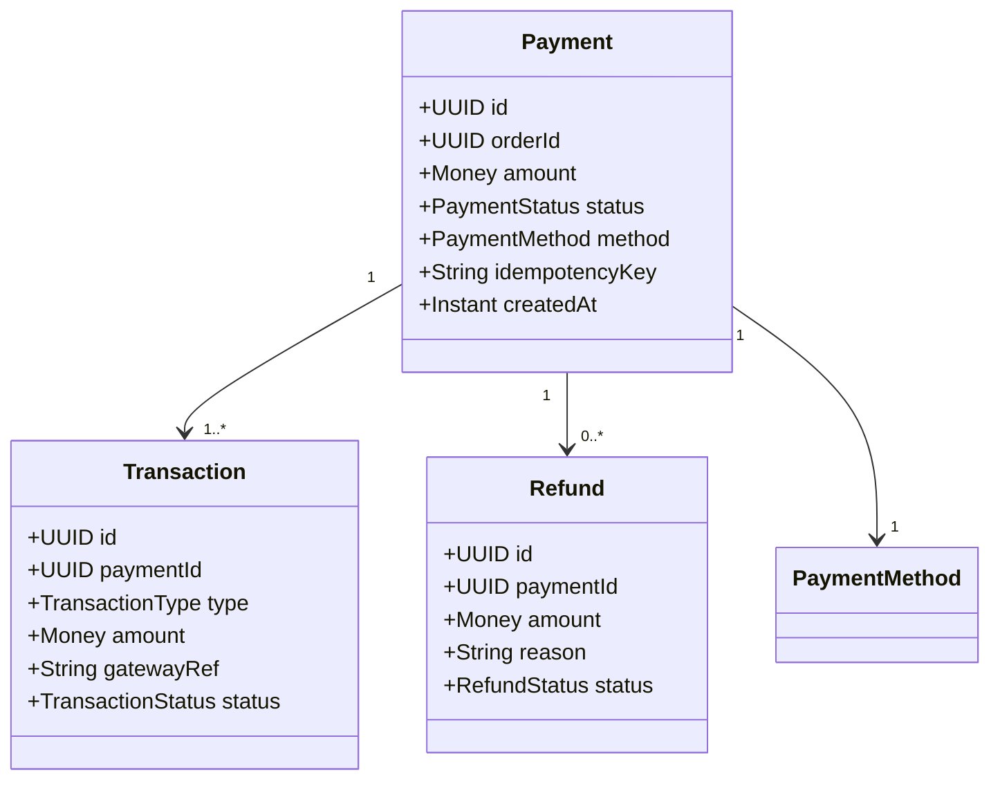

# Payment Domain

## Domain Model

## Business Rules
1. **Idempotency**: Every payment request MUST have an idempotency key. Duplicate keys return existing result.
2. **State Machine**: PENDING → AUTHORIZED → CAPTURED → (REFUNDED). No backward transitions.
3. **Partial Refunds**: Allowed up to original captured amount. Sum of refunds ≤ captured amount.
4. **Currency Consistency**: All amounts in a payment must use the same currency.
5. **Timeout**: Authorization expires after 7 days. Must capture before expiry.

## Code Entry Points
- `PaymentController` — `/api/v1/payments`
- `PaymentService` — Core business logic
- `PaymentGatewayClient` — External gateway integration
- `PaymentEventListener` — Handles async events (OrderCreated → InitiatePayment)

## FAQ
- **Q: How to test payment locally?** A: Use gateway sandbox mode via `PAYMENT_GATEWAY_SANDBOX=true`
- **Q: What happens on gateway timeout?** A: Retry with exponential backoff (3 attempts), then mark as FAILED
- **Q: How are refunds processed?** A: Async via RefundService. Gateway webhook confirms completion.
