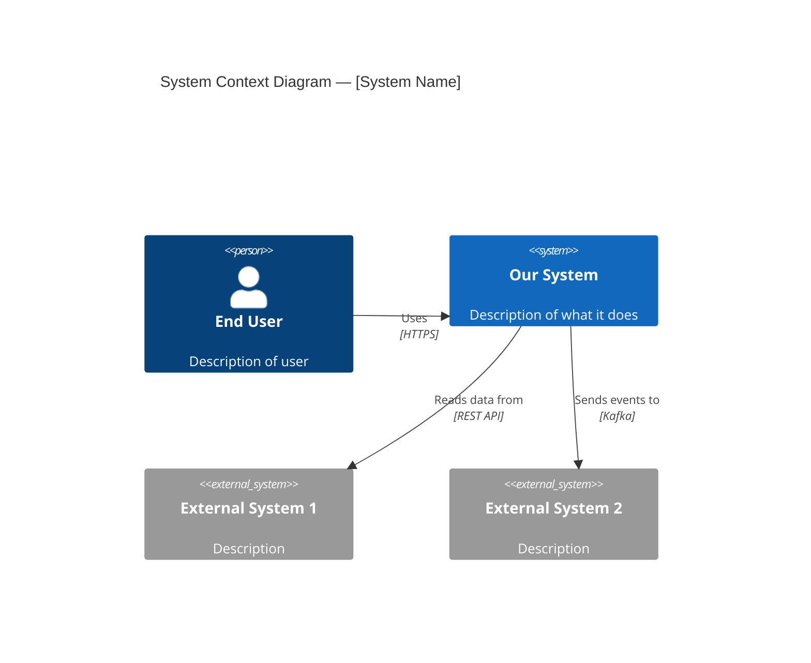
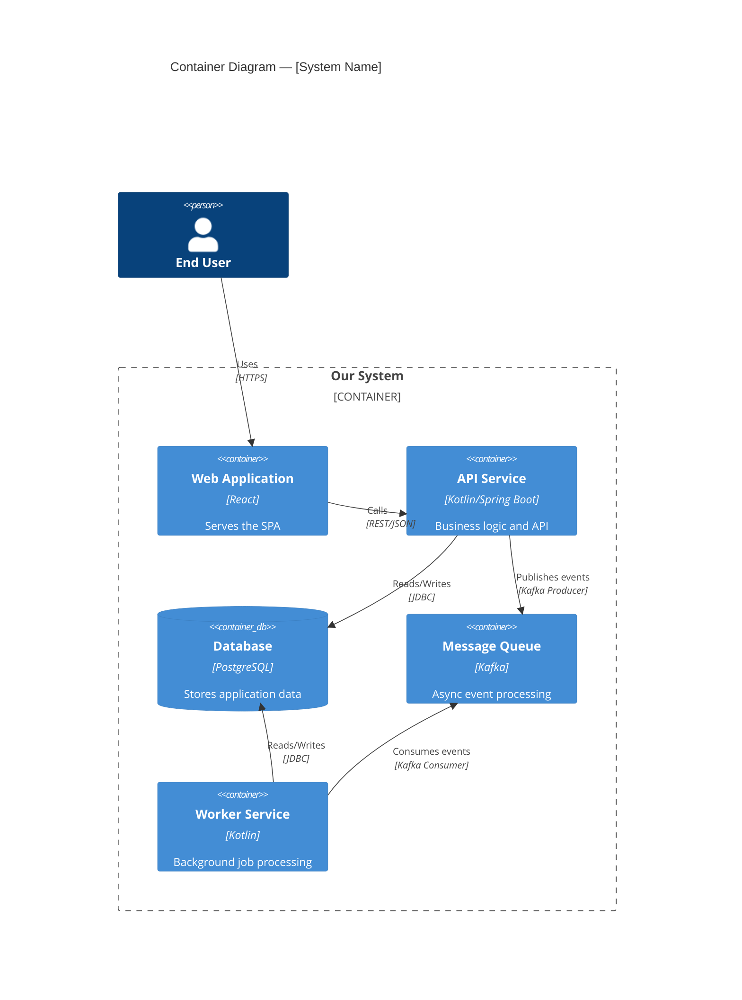
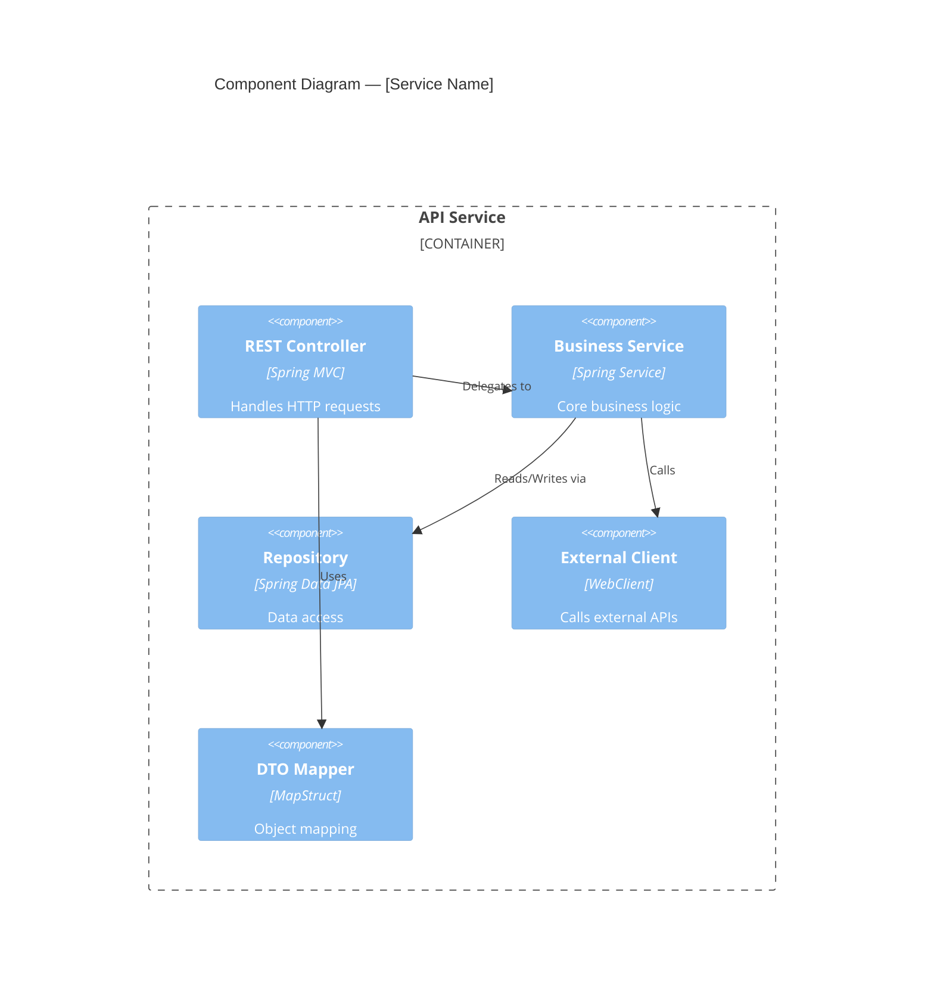

# Architecture Design Skill

## Purpose

This skill guides the SuperAgent in creating well-structured architecture designs using the C4 model, documenting decisions through ADRs, mapping non-functional requirements to architectural patterns, and making principled technology selections.

---

## C4 Model

The C4 model provides four levels of architectural abstraction. Use the appropriate level based on the design scope.

### Level 1: System Context Diagram

**When to use**: Always. Every design starts here.

**Shows**: The system being designed and its relationships with users and external systems.



**Guidelines**:
- Focus on WHO uses the system and WHAT external systems it interacts with
- Do NOT include internal details
- Label relationships with both the action and the protocol
- Include all external dependencies (databases-as-a-service, cloud services, third-party APIs)

### Level 2: Container Diagram

**When to use**: Always for new services; when modifying service boundaries.

**Shows**: The high-level technology choices and how containers communicate.



**Guidelines**:
- One box per deployable unit (service, database, queue, etc.)
- Include the technology stack in each container
- Show communication protocols on relationship arrows
- Group containers within system boundaries

### Level 3: Component Diagram

**When to use**: For services being designed or significantly modified.

**Shows**: The internal structure of a container — its major components and their interactions.



**Guidelines**:
- Show the layered architecture within the service
- Verify dependency direction: controllers -> services -> repositories
- Identify cross-cutting concerns (security, logging, caching)
- Flag any violations of the dependency rule

### Level 4: Code Diagram

**When to use**: Only for particularly complex or critical components.

**Shows**: Class-level detail — usually a class diagram.

**Guidelines**:
- Use sparingly — most code structure is better communicated through the code itself
- Focus on interfaces, abstract classes, and key design patterns
- Useful for: domain model, plugin architectures, strategy patterns

---

## Architecture Decision Records (ADRs)

### ADR Template

```markdown
# ADR-[NNN]: [Decision Title]

## Status
Proposed | Accepted | Deprecated | Superseded by ADR-XXX

## Date
[YYYY-MM-DD]

## Context
[What is the issue that we're seeing that motivates this decision?
What are the forces at play — technical, business, organizational?
Include specific numbers and facts, not just opinions.]

## Options Considered

### Option 1: [Name]
- **Description**: [how it works]
- **Pros**: [advantages]
- **Cons**: [disadvantages]
- **Effort**: [estimated effort]

### Option 2: [Name]
- **Description**: [how it works]
- **Pros**: [advantages]
- **Cons**: [disadvantages]
- **Effort**: [estimated effort]

### Option 3: [Name]
- **Description**: [how it works]
- **Pros**: [advantages]
- **Cons**: [disadvantages]
- **Effort**: [estimated effort]

## Decision
[Which option was chosen and WHY.
The rationale must be clear enough that someone reading this in 2 years
understands the trade-offs that were made.]

## Consequences

### Positive
- [benefit 1]
- [benefit 2]

### Negative
- [trade-off 1 — and how we'll mitigate it]
- [trade-off 2 — and how we'll mitigate it]

### Risks
- [risk 1 — and monitoring/mitigation plan]

## Related
- ADR-XXX: [related decision]
- [link to PRD requirement]
- [link to design doc section]
```

### ADR Guidelines

1. **One decision per ADR**: Do not bundle multiple decisions
2. **Include all considered options**: Even options that were rejected
3. **Explain the "why"**: The rationale is more important than the decision itself
4. **Acknowledge trade-offs**: Every decision has downsides; document them
5. **Link to context**: Reference PRD requirements, constraints, and other ADRs
6. **Keep ADRs immutable**: When a decision changes, create a new ADR that supersedes the old one
7. **Use concrete evidence**: "Option A is 3x faster in benchmarks" not "Option A is faster"

---

## Non-Functional Requirements Mapping

Map each NFR category to architectural patterns:

### Performance

| NFR Target                        | Architectural Pattern                          |
|-----------------------------------|------------------------------------------------|
| Low latency (< 100ms)            | In-memory caching (Redis), read replicas       |
| High throughput (> 1000 rps)     | Horizontal scaling, async processing           |
| Large data sets                   | Pagination, streaming, CQRS                    |
| Complex queries                   | Materialized views, search index (Elasticsearch)|
| Batch processing                  | Job queues, scheduled tasks, parallel execution |

### Scalability

| NFR Target                        | Architectural Pattern                          |
|-----------------------------------|------------------------------------------------|
| Horizontal scaling                | Stateless services, external session store      |
| Data partitioning                 | Database sharding, tenant isolation             |
| Geographic distribution           | Multi-region deployment, CDN, edge caching      |
| Traffic spikes                    | Auto-scaling, queue-based load leveling         |
| Microservice independence         | Service mesh, API gateway, async communication  |

### Reliability

| NFR Target                        | Architectural Pattern                          |
|-----------------------------------|------------------------------------------------|
| High availability (99.99%)        | Multi-AZ deployment, active-passive failover    |
| Fault tolerance                   | Circuit breaker, bulkhead, retry with backoff   |
| Data durability                   | Replication, backup, WAL                        |
| Graceful degradation              | Feature flags, fallback responses, cache-aside  |
| Disaster recovery                 | Cross-region replication, infrastructure-as-code |

### Security

| NFR Target                        | Architectural Pattern                          |
|-----------------------------------|------------------------------------------------|
| Authentication                    | OAuth2/OIDC, JWT, API key management            |
| Authorization                     | RBAC, ABAC, policy engine                       |
| Data protection                   | Encryption at rest (AES-256), TLS 1.3 in transit|
| API security                      | Rate limiting, input validation, WAF            |
| Audit                             | Immutable audit log, event sourcing             |

---

## Technology Selection Criteria

When the design requires a new technology, evaluate against these criteria:

### Evaluation Matrix

| Criterion            | Weight | Option A | Option B | Option C |
|----------------------|--------|----------|----------|----------|
| Team familiarity     | 20%    | [1-5]   | [1-5]   | [1-5]   |
| Community/ecosystem  | 15%    | [1-5]   | [1-5]   | [1-5]   |
| Performance          | 20%    | [1-5]   | [1-5]   | [1-5]   |
| Operational burden   | 15%    | [1-5]   | [1-5]   | [1-5]   |
| Licensing            | 10%    | [1-5]   | [1-5]   | [1-5]   |
| Security             | 10%    | [1-5]   | [1-5]   | [1-5]   |
| Long-term viability  | 10%    | [1-5]   | [1-5]   | [1-5]   |

### Selection Rules

1. **Prefer existing stack**: Only introduce new technology if existing options are clearly inadequate
2. **Prototype first**: For high-impact decisions, build a proof-of-concept before committing
3. **Document in ADR**: Every technology selection must have an ADR
4. **Consider operations**: Who will maintain this in production? Do they have the skills?
5. **Check license compatibility**: Ensure license is compatible with the project and any commercial use
6. **Assess vendor lock-in**: Can we switch to an alternative without rewriting the system?
7. **Evaluate maturity**: Prefer stable, well-documented technologies over bleeding-edge

---

## Design Review Checklist

Before submitting the architecture design for HITL review:

- [ ] System Context diagram shows all external dependencies
- [ ] Container diagram shows all deployable units and communication
- [ ] Component diagrams exist for new/modified services
- [ ] ADRs written for all significant decisions
- [ ] NFRs mapped to architectural patterns
- [ ] No cross-layer dependency violations
- [ ] No circular dependencies
- [ ] Service boundaries are clear and justified
- [ ] Data flow is traceable end-to-end
- [ ] Failure modes are identified with mitigation
- [ ] Security considerations are addressed at each layer
- [ ] Scalability path is clear
- [ ] Operational requirements are addressed (logging, monitoring, alerting)
