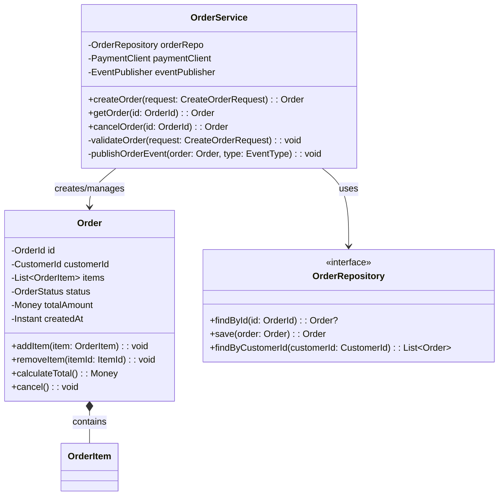
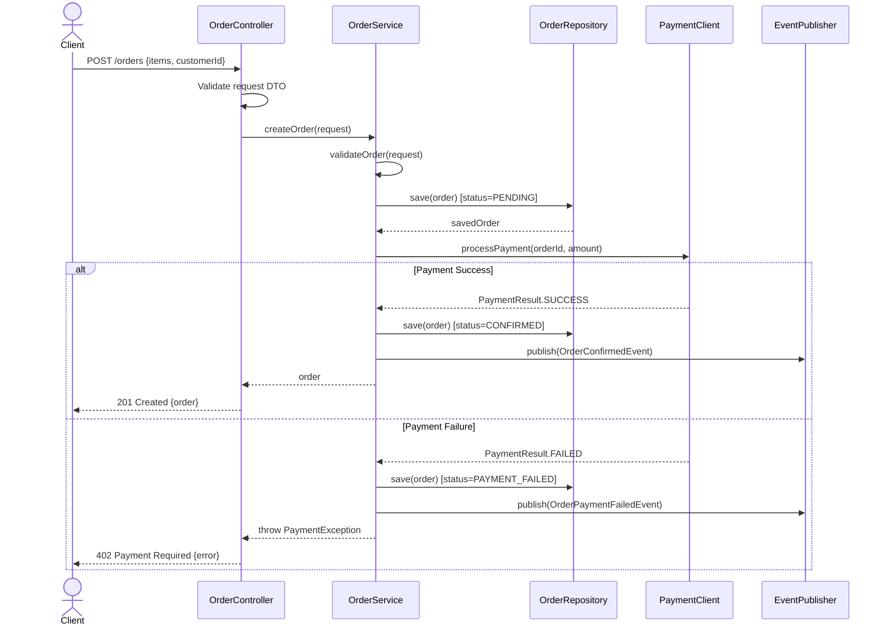

# Detailed Design Skill

## Purpose

This skill guides the SuperAgent in translating architecture-level decisions into implementation-ready detailed designs: class structures, interaction flows, API contracts, database schemas, and error handling strategies.

---

## Class Diagram Generation

### When to Create Class Diagrams

- New domain model classes
- Significant refactoring of existing class hierarchies
- Design patterns being introduced (Strategy, Observer, Factory, etc.)
- Complex service layer with multiple collaborating classes

### Mermaid Class Diagram Pattern



### Class Diagram Guidelines

1. **Show relationships clearly**: association (-->), composition (*--), aggregation (o--), inheritance (--|>), implementation (..|>)
2. **Include visibility modifiers**: + public, - private, # protected
3. **Show method signatures**: parameter types and return types
4. **Group related classes**: Use packages or namespaces
5. **Focus on design intent**: Show the important relationships, not every field

### Design Principles to Apply

- **Single Responsibility**: Each class has one reason to change
- **Open/Closed**: Classes are open for extension, closed for modification
- **Dependency Inversion**: Depend on abstractions (interfaces), not concrete classes
- **Interface Segregation**: Prefer small, focused interfaces over large ones
- **Composition over Inheritance**: Favor composition for code reuse

---

## Sequence Diagram for Key Flows

### When to Create Sequence Diagrams

- Every API endpoint's primary flow (happy path)
- Complex business processes with multiple service interactions
- Asynchronous flows (event-driven, message queue)
- Error handling flows for critical operations

### Mermaid Sequence Diagram Pattern



### Sequence Diagram Guidelines

1. **Show both happy path and error paths** in the same diagram using `alt/else`
2. **Label every message** with the method name and key parameters
3. **Show return values** on return arrows
4. **Include async patterns** when applicable:
   ```
   Service->>Queue: publish(event)
   Note right of Queue: Async processing
   Queue->>Worker: consume(event)
   ```
5. **Keep diagrams focused**: One diagram per use case or API endpoint
6. **Show database operations**: Include save/query operations explicitly
7. **Number complex flows**: Use activation bars to show processing scope

---

## API Contract Design (OpenAPI)

### OpenAPI 3.0 Template

```yaml
openapi: 3.0.3
info:
  title: [Service Name] API
  version: 1.0.0
  description: [Service description]

servers:
  - url: /api/v1
    description: API v1

paths:
  /orders:
    post:
      operationId: createOrder
      summary: Create a new order
      tags:
        - Orders
      security:
        - bearerAuth: []
      requestBody:
        required: true
        content:
          application/json:
            schema:
              $ref: '#/components/schemas/CreateOrderRequest'
            example:
              customerId: "cust-123"
              items:
                - productId: "prod-456"
                  quantity: 2
      responses:
        '201':
          description: Order created successfully
          content:
            application/json:
              schema:
                $ref: '#/components/schemas/OrderResponse'
        '400':
          description: Invalid request
          content:
            application/json:
              schema:
                $ref: '#/components/schemas/ErrorResponse'
        '401':
          description: Authentication required
        '422':
          description: Business rule violation
          content:
            application/json:
              schema:
                $ref: '#/components/schemas/ErrorResponse'

components:
  schemas:
    CreateOrderRequest:
      type: object
      required:
        - customerId
        - items
      properties:
        customerId:
          type: string
          format: uuid
          description: ID of the customer placing the order
        items:
          type: array
          minItems: 1
          items:
            $ref: '#/components/schemas/OrderItemRequest'

    OrderItemRequest:
      type: object
      required:
        - productId
        - quantity
      properties:
        productId:
          type: string
          format: uuid
        quantity:
          type: integer
          minimum: 1
          maximum: 999

    OrderResponse:
      type: object
      properties:
        id:
          type: string
          format: uuid
        customerId:
          type: string
          format: uuid
        items:
          type: array
          items:
            $ref: '#/components/schemas/OrderItemResponse'
        status:
          type: string
          enum: [PENDING, CONFIRMED, SHIPPED, DELIVERED, CANCELLED]
        totalAmount:
          $ref: '#/components/schemas/Money'
        createdAt:
          type: string
          format: date-time

    ErrorResponse:
      type: object
      required:
        - code
        - message
      properties:
        code:
          type: string
          description: Machine-readable error code
          example: "ORDER_ITEM_OUT_OF_STOCK"
        message:
          type: string
          description: Human-readable error message
        details:
          type: array
          items:
            $ref: '#/components/schemas/ErrorDetail'

    ErrorDetail:
      type: object
      properties:
        field:
          type: string
          description: Field that caused the error
        message:
          type: string
          description: Specific error for this field

    Money:
      type: object
      properties:
        amount:
          type: string
          format: decimal
          example: "99.99"
        currency:
          type: string
          example: "USD"

  securitySchemes:
    bearerAuth:
      type: http
      scheme: bearer
      bearerFormat: JWT
```

### API Design Rules

1. **Resource naming**: Use plural nouns (`/orders`, `/users`), not verbs
2. **HTTP methods**: GET (read), POST (create), PUT (full update), PATCH (partial update), DELETE (remove)
3. **Status codes**: Use specific codes (201 Created, 404 Not Found, 422 Unprocessable) not just 200/500
4. **Pagination**: Use `page` and `size` query parameters; return `totalElements` and `totalPages`
5. **Filtering**: Use query parameters for filtering; support multiple values with comma separation
6. **Sorting**: Use `sort` query parameter with format `field,direction` (e.g., `sort=createdAt,desc`)
7. **Versioning**: URL path versioning (`/api/v1/`) for major versions
8. **Error format**: Consistent ErrorResponse schema across all endpoints
9. **Validation**: Define constraints in schema (min, max, pattern, required)
10. **Examples**: Include request and response examples for every endpoint

---

## Database Schema Design

### Schema Design Process

1. **Identify entities** from the domain model (class diagram)
2. **Map relationships**: one-to-one, one-to-many, many-to-many
3. **Define columns**: types, constraints, defaults, indices
4. **Design for queries**: Add indices based on expected query patterns
5. **Plan migrations**: Write forward and rollback migration scripts

### DDL Template (PostgreSQL)

```sql
-- Migration: V001__create_orders_table.sql

CREATE TABLE orders (
    id            UUID PRIMARY KEY DEFAULT gen_random_uuid(),
    customer_id   UUID NOT NULL,
    status        VARCHAR(20) NOT NULL DEFAULT 'PENDING',
    total_amount  DECIMAL(12,2) NOT NULL DEFAULT 0.00,
    currency      VARCHAR(3) NOT NULL DEFAULT 'USD',
    created_at    TIMESTAMP WITH TIME ZONE NOT NULL DEFAULT NOW(),
    updated_at    TIMESTAMP WITH TIME ZONE NOT NULL DEFAULT NOW(),

    CONSTRAINT chk_order_status CHECK (status IN ('PENDING', 'CONFIRMED', 'SHIPPED', 'DELIVERED', 'CANCELLED')),
    CONSTRAINT chk_total_amount_positive CHECK (total_amount >= 0)
);

CREATE TABLE order_items (
    id            UUID PRIMARY KEY DEFAULT gen_random_uuid(),
    order_id      UUID NOT NULL REFERENCES orders(id) ON DELETE CASCADE,
    product_id    UUID NOT NULL,
    quantity      INTEGER NOT NULL,
    unit_price    DECIMAL(12,2) NOT NULL,
    created_at    TIMESTAMP WITH TIME ZONE NOT NULL DEFAULT NOW(),

    CONSTRAINT chk_quantity_positive CHECK (quantity > 0),
    CONSTRAINT chk_unit_price_positive CHECK (unit_price >= 0)
);

-- Indices for common queries
CREATE INDEX idx_orders_customer_id ON orders(customer_id);
CREATE INDEX idx_orders_status ON orders(status);
CREATE INDEX idx_orders_created_at ON orders(created_at DESC);
CREATE INDEX idx_order_items_order_id ON order_items(order_id);
CREATE INDEX idx_order_items_product_id ON order_items(product_id);

-- Rollback: V001__create_orders_table_rollback.sql
-- DROP TABLE IF EXISTS order_items;
-- DROP TABLE IF EXISTS orders;
```

### Schema Design Rules

1. **Always use UUIDs** for primary keys (avoid sequential IDs for distributed systems)
2. **Always include timestamps**: `created_at` and `updated_at` on every table
3. **Use constraints**: CHECK constraints for enums and ranges, NOT NULL where appropriate
4. **Index for queries**: Create indices based on WHERE clauses and JOIN conditions
5. **Plan for soft deletes**: Add `deleted_at` column if soft delete is needed
6. **Normalize appropriately**: 3NF for transactional data; denormalize for read-heavy patterns
7. **Version migrations**: Use sequential numbering (V001, V002) with descriptive names
8. **Always write rollback**: Every migration must have a corresponding rollback script

---

## Error Handling Strategy

### Exception Hierarchy

```
ApplicationException (abstract base)
├── BusinessException (HTTP 422)
│   ├── OrderNotFoundException
│   ├── InsufficientStockException
│   └── PaymentDeclinedException
├── ValidationException (HTTP 400)
│   ├── InvalidInputException
│   └── MissingRequiredFieldException
├── AuthenticationException (HTTP 401)
├── AuthorizationException (HTTP 403)
└── InfrastructureException (HTTP 503)
    ├── ExternalServiceUnavailableException
    └── DatabaseConnectionException
```

### Error Handling Rules

1. **Map exceptions to HTTP status codes** consistently
2. **Never expose internal details** in error responses (no stack traces, no SQL)
3. **Use error codes** for machine-readable identification (e.g., `ORDER_NOT_FOUND`)
4. **Include helpful messages** for human readers
5. **Log the full exception** server-side with correlation ID
6. **Return correlation ID** in error responses for debugging
7. **Handle external service failures** with circuit breakers and fallbacks
8. **Validate at the boundary**: Validate input in controllers before passing to services
9. **Fail fast**: Throw exceptions early rather than propagating invalid state

### Error Response Format

```json
{
  "code": "ORDER_NOT_FOUND",
  "message": "Order with ID '550e8400-e29b-41d4-a716-446655440000' was not found",
  "correlationId": "req-abc-123",
  "timestamp": "2025-01-15T10:30:00Z",
  "details": []
}
```

### Validation Error Response

```json
{
  "code": "VALIDATION_ERROR",
  "message": "Request validation failed",
  "correlationId": "req-abc-124",
  "timestamp": "2025-01-15T10:30:00Z",
  "details": [
    {
      "field": "items[0].quantity",
      "message": "must be greater than 0"
    },
    {
      "field": "customerId",
      "message": "must not be null"
    }
  ]
}
```
