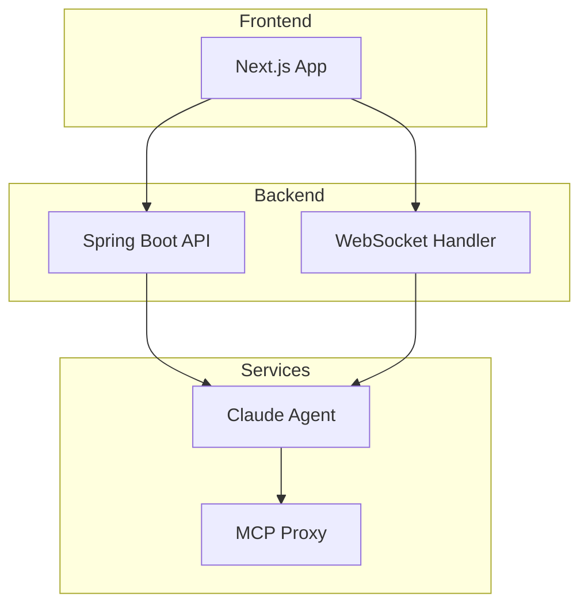

# Document Generation Skill

## Purpose

Generates various types of project documentation by analyzing the codebase, knowledge base, and project artifacts. Supports architecture diagrams (Mermaid), usage manuals, progress reports, and API documentation.

## When to Use

- "生成架构图" / "generate architecture diagram"
- "生成使用手册" / "create usage manual"
- "把进展写成报告" / "generate progress report"
- "生成 API 文档" / "create API documentation"
- "写周报" / "create weekly summary"

## Document Types

### 1. Architecture Diagram (Mermaid)

Analyze the project structure and generate Mermaid diagrams:



**Process**:
1. `workspace_list_files` to map project structure
2. Read key configuration files to identify components
3. Identify communication patterns (REST, WebSocket, MCP)
4. Generate appropriate diagram type:
   - **C4 Context**: System boundaries and external actors
   - **C4 Container**: Internal services and data stores
   - **Sequence**: Request/response flows
   - **Class**: Domain model relationships
   - **ER**: Database schema

### 2. Usage Manual

**Template**:
```markdown
# [Project Name] Usage Manual

## Quick Start
[Minimal steps to get running]

## Prerequisites
[Required software, accounts, configs]

## Installation
[Step-by-step installation]

## Configuration
[Environment variables, config files]

## Features
### [Feature 1]
[Description + screenshots/examples]

### [Feature 2]
[Description + screenshots/examples]

## Troubleshooting
| Problem | Solution |
|---------|----------|
| ... | ... |

## FAQ
[Common questions and answers]
```

**Process**:
1. Read README and existing docs
2. Analyze project features from code structure
3. Check for Docker/deployment configs
4. Generate comprehensive manual

### 3. Progress Report

Uses the **progress-evaluation** skill's output as input, then formats it for different audiences:

- **Technical Report**: Detailed metrics, code quality, architecture assessment
- **Management Summary**: High-level status, risks, timeline
- **Weekly Update**: What was done, what's next, blockers

### 4. API Documentation

**Process**:
1. Find controller/endpoint files
2. Extract endpoint definitions (paths, methods, parameters)
3. Identify request/response DTOs
4. Generate OpenAPI-style documentation:

```markdown
## API Endpoints

### POST /api/chat/sessions
Create a new chat session.

**Request Body**:
```json
{
  "workspaceId": "string"
}
```

**Response** (200):
```json
{
  "id": "string",
  "workspaceId": "string",
  "createdAt": "ISO-8601"
}
```
```

## Output Rules

1. **Always present in chat first** — do not write to files unless explicitly asked
2. When saving, suggest appropriate paths:
   - Architecture diagrams: `docs/architecture/`
   - Manuals: `docs/guides/`
   - Reports: `docs/reports/`
   - API docs: `docs/api/`
3. Use Mermaid syntax for diagrams (renderable in Markdown viewers)
4. Include generation metadata (date, source files analyzed)

## Integration

- **Profile**: evaluation-profile (primary), development-profile (on-demand)
- **Related Skills**: progress-evaluation (provides data for reports)
- **Tools used**: `workspace_list_files`, `workspace_read_file`, `search_knowledge`, `workspace_write_file` (only when user requests save)
