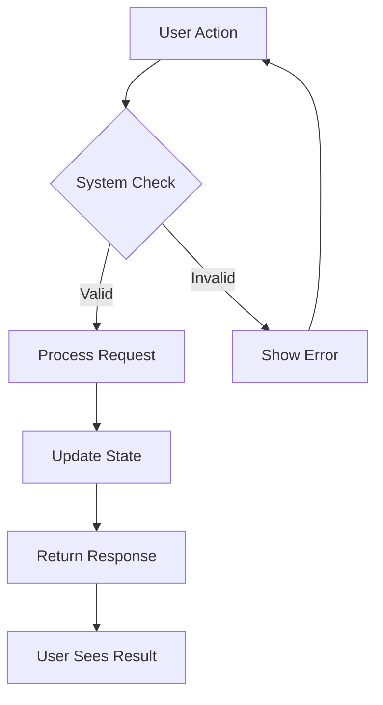
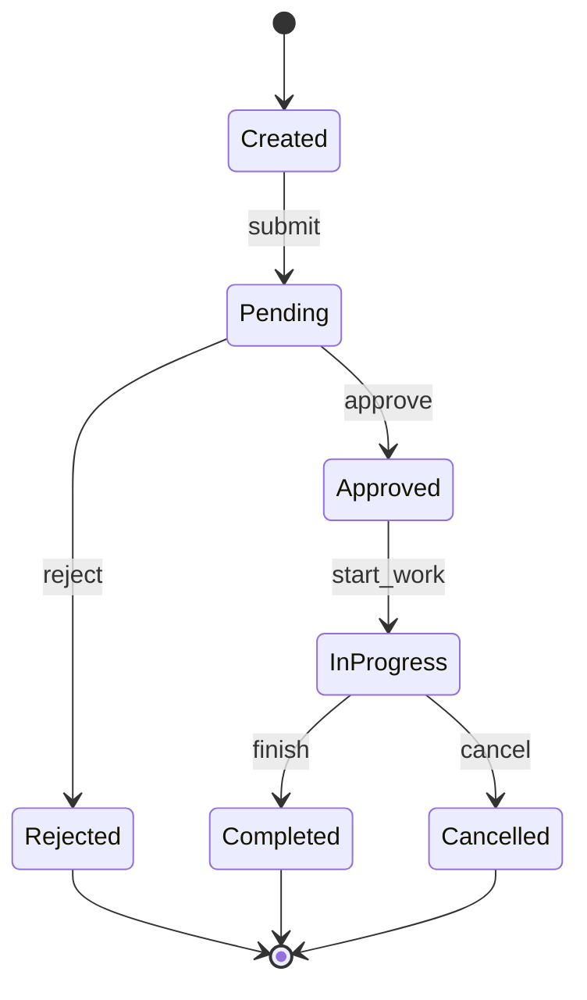
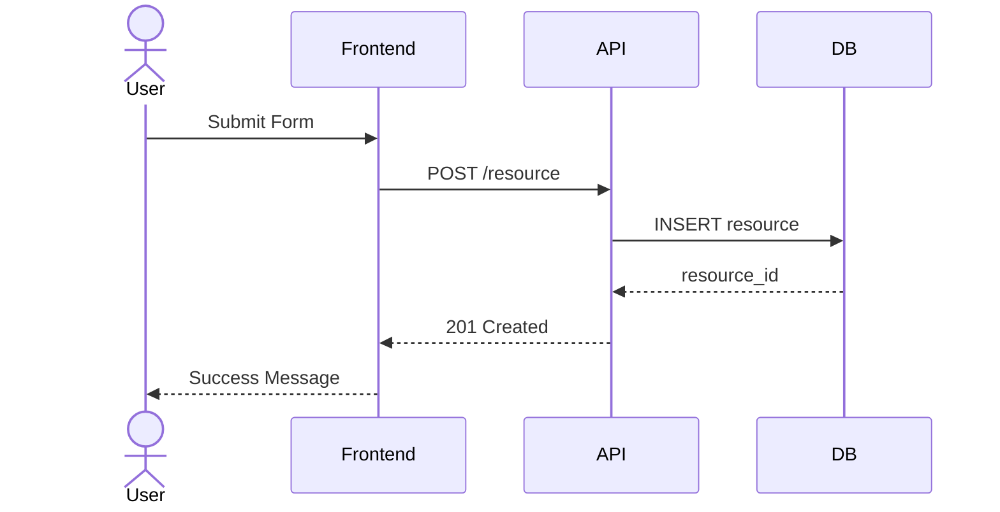

# PRD Writing Skill

## Purpose

This skill guides the SuperAgent in authoring clear, comprehensive Product Requirements Documents (PRDs) that serve as the single source of truth for a feature from planning through delivery.

---

## PRD Template Structure

Every PRD follows this structure. Sections may be shortened for smaller features but never omitted entirely.

```markdown
# PRD: [Feature Name]

## Metadata
- **Author**: [name]
- **Status**: Draft | In Review | Approved | Superseded
- **Created**: [date]
- **Last Updated**: [date]
- **Reviewers**: [list]
- **Related Issues**: [links]

## 1. Background & Problem Statement
[Why does this feature exist? What problem are we solving?
Include data, customer feedback, or business context that motivates this work.]

## 2. Goals & Non-Goals

### Goals
- [Specific, measurable outcome 1]
- [Specific, measurable outcome 2]

### Non-Goals
- [Explicitly excluded scope item 1]
- [Explicitly excluded scope item 2]

## 3. User Personas

### Persona 1: [Name]
- **Role**: [description]
- **Goals**: [what they want to achieve]
- **Pain Points**: [current frustrations]
- **Technical Proficiency**: [low/medium/high]

## 4. User Stories & Acceptance Criteria

### Epic: [Epic Name]

#### Story 1: [Story Title]
As a [persona], I want to [action], so that [benefit].

**Acceptance Criteria**:
1. Given [context], When [action], Then [outcome]
2. Given [context], When [action], Then [outcome]

**Priority**: P0 (must-have) | P1 (should-have) | P2 (nice-to-have)

## 5. User Flows

[Mermaid diagrams showing key user journeys]

## 6. Functional Requirements

### FR-001: [Requirement Title]
- **Description**: [detailed description]
- **Input**: [what the system receives]
- **Processing**: [what the system does]
- **Output**: [what the system produces]
- **Validation**: [input validation rules]

## 7. Non-Functional Requirements

### Performance
- [specific targets]

### Security
- [specific requirements]

### Scalability
- [specific targets]

### Reliability
- [specific targets]

## 8. Scope & Boundaries

### In Scope
- [item 1]
- [item 2]

### Out of Scope
- [item 1] — [reason]
- [item 2] — [reason]

### Future Considerations
- [item that may be addressed in a future iteration]

## 9. Dependencies & Risks

### Dependencies
| ID | Dependency | Owner | Status | Impact if Delayed |
|----|-----------|-------|--------|-------------------|
| D1 | ...       | ...   | ...    | ...               |

### Risks
| ID | Risk | Probability | Impact | Mitigation |
|----|------|-------------|--------|------------|
| R1 | ...  | ...         | ...    | ...        |

## 10. Timeline & Milestones

| Milestone    | Target Date | Description                |
|-------------|-------------|----------------------------|
| Design      | [date]      | Architecture design complete|
| Dev Start   | [date]      | Development begins          |
| Alpha       | [date]      | Internal testing begins     |
| Beta        | [date]      | External testing begins     |
| GA          | [date]      | General availability        |

## 11. Success Metrics

| Metric              | Current Value | Target Value | Measurement Method |
|---------------------|--------------|--------------|-------------------|
| [metric name]       | [baseline]   | [target]     | [how to measure]  |

## 12. Open Questions

| # | Question | Owner | Due Date | Resolution |
|---|----------|-------|----------|------------|
| 1 | ...      | ...   | ...      | ...        |

## 13. Appendix

[Supporting data, research, competitive analysis, technical notes]
```

---

## Writing Guidelines

### Be Specific and Measurable

Every requirement must be concrete enough to test:

| Bad                                | Good                                                         |
|------------------------------------|--------------------------------------------------------------|
| "The system should be fast"        | "API response time < 200ms at p95 under 1000 concurrent users"|
| "Users should be able to search"   | "Users can search orders by ID, date range, and status with results returned in < 500ms" |
| "The feature should be secure"     | "All endpoints require JWT authentication; admin endpoints require ADMIN role" |
| "Handle errors gracefully"         | "On validation error, return HTTP 400 with error code, field name, and message" |

### Be Unambiguous

Avoid words that are open to interpretation:

| Ambiguous Word | Replace With                     |
|----------------|----------------------------------|
| "should"       | "must" (required) or "may" (optional) |
| "etc."         | List all items explicitly         |
| "appropriate"  | Define what is appropriate         |
| "reasonable"   | Specify the exact threshold        |
| "user-friendly"| Specify concrete UX requirements   |
| "efficient"    | Specify time/resource constraints  |
| "robust"       | Specify failure handling behavior  |

### Write for Multiple Audiences

The PRD is read by:
- **Product managers**: Focus on Goals, User Stories, Success Metrics
- **Designers**: Focus on Personas, User Flows, Functional Requirements
- **Engineers**: Focus on Functional Requirements, NFRs, Dependencies
- **QA**: Focus on Acceptance Criteria, Edge Cases, NFRs
- **Executives**: Focus on Background, Goals, Timeline, Success Metrics

### Structure for Scannability

- Use headers and sub-headers liberally
- Use tables for structured data
- Use bullet lists for enumerations
- Use bold for key terms
- Keep paragraphs short (3-5 sentences max)
- Put the most important information first in each section

---

## Mermaid Diagrams for User Flows

### When to Use Diagrams

- **Always**: Primary user journey (happy path)
- **Always**: Error/exception flows that are complex
- **When relevant**: State transitions for stateful entities
- **When relevant**: Data flow between systems
- **When relevant**: Decision trees for complex business rules

### User Flow Diagram Pattern



### State Diagram Pattern



### Sequence Diagram Pattern (for multi-system flows)



### Diagram Guidelines

1. **Label every arrow** with the action or data being passed
2. **Show error paths** — not just the happy path
3. **Include actors** — who/what initiates the flow
4. **Keep diagrams focused** — one diagram per flow, not everything in one
5. **Use consistent naming** — match diagram labels with requirement IDs

---

## Quality Checklist

Before finalizing a PRD, verify:

### Completeness
- [ ] All template sections are filled (or explicitly marked N/A with reason)
- [ ] Every user story has acceptance criteria
- [ ] Non-functional requirements are quantified
- [ ] Dependencies are identified with owners
- [ ] Risks have mitigation strategies
- [ ] Success metrics have baselines and targets

### Consistency
- [ ] Terminology is consistent throughout
- [ ] User story personas match the Personas section
- [ ] Scope section aligns with Goals and Non-Goals
- [ ] Timeline is realistic given Dependencies and Risks

### Testability
- [ ] Every functional requirement can be verified by a test
- [ ] Every acceptance criterion follows Given-When-Then format
- [ ] NFR targets have specific measurement methods
- [ ] Success metrics have defined measurement approaches

### Clarity
- [ ] No ambiguous words (should, appropriate, reasonable, etc.)
- [ ] No jargon without definition
- [ ] No assumptions without explicit statement
- [ ] Technical terms are consistent with project glossary

---

## PRD Review Checklist (for HITL Checkpoint)

When presenting the PRD for human review, include this checklist:

1. **Problem clarity**: Is the problem statement clear and supported by data?
2. **Goal alignment**: Do the goals address the problem?
3. **Scope appropriateness**: Is the scope achievable and well-bounded?
4. **User story coverage**: Are all user needs captured?
5. **Acceptance criteria quality**: Are criteria specific and testable?
6. **NFR completeness**: Are all relevant NFR categories addressed?
7. **Risk awareness**: Are major risks identified and mitigated?
8. **Timeline realism**: Is the timeline achievable given the scope?
9. **Success measurability**: Can we actually measure the success metrics?
10. **Open questions**: Are there unresolved questions that block progress?
